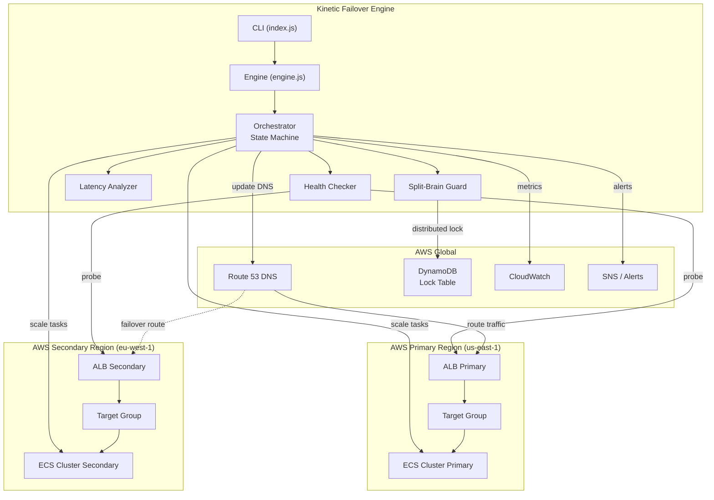

# ⚡ Kinetic Failover Engine

**Zero-Downtime Regional Failover for AWS ECS/ALB Infrastructure**

A production-grade Node.js orchestration engine that continuously monitors AWS ALB endpoints, detects regional latency spikes or outages, and automatically triggers zero-downtime failover — routing traffic to a mirrored ECS cluster in a secondary AWS region before a human even sees the alert.

---

## Architecture



## How Failover Works

```
MONITORING ──→ DEGRADED ──→ FAILING_OVER ──→ FAILED_OVER ──→ RECOVERING ──→ MONITORING
     ↑              │                                              │              ↑
     └──── healthy ──┘                                              └── primary ──┘
                                                                        recovered
```

1. **MONITORING** — Engine probes the primary ALB every 5 seconds (configurable)
2. **DEGRADED** — Latency spike or partial target failures detected
3. **FAILING_OVER** — Consecutive failures hit threshold → engine acquires DynamoDB lock → scales up secondary ECS → updates Route 53 DNS
4. **FAILED_OVER** — Traffic flows to secondary. Engine monitors primary for recovery.
5. **RECOVERING** — Primary is healthy again → DNS switches back, secondary scales down
6. **MONITORING** — Back to normal operation

## Quick Start

### Prerequisites

- **Node.js 20+** — [Download](https://nodejs.org/)
- **AWS Account** with credentials configured (`~/.aws/credentials` or env vars)
- **Terraform 1.5+** (optional, for infrastructure deployment)

### 1. Install

```bash
git clone https://github.com/manishsamota1/kinetic-failover-engine.git
cd kinetic-failover-engine
npm install
```

### 2. Configure

```bash
# Copy the example environment file
cp .env.example .env

# Edit .env with your AWS resource details
# Or edit config/default.yaml for the full configuration
```

### 3. Run (Dry Run — No AWS Changes)

```bash
npm run dry-run
```

This starts the engine in **dry-run mode** — it logs every decision it would make but does NOT modify any AWS resources. Perfect for testing.

### 4. Run (Live)

```bash
npm start
```

### 5. Run Chaos Simulation

```bash
npm run chaos
```

Simulates a full primary region outage and demonstrates the failover lifecycle. No AWS resources are touched.

## Deploy Infrastructure (Terraform)

```bash
cd terraform

# Initialize
terraform init

# Preview changes
terraform plan -var-file=environments/dev.tfvars

# Deploy (this creates real AWS resources — incurs costs!)
terraform apply -var-file=environments/dev.tfvars
```

## Configuration Reference

| Setting | Default | Description |
|---------|---------|-------------|
| `engine.healthCheckIntervalMs` | `5000` | How often to probe the ALB |
| `engine.latencyThresholdMs` | `200` | P95 latency above this triggers degraded state |
| `engine.failureThreshold` | `3` | Consecutive failures before failover |
| `engine.cooldownPeriodMs` | `60000` | Minimum time between failover events |
| `engine.dryRun` | `false` | Log decisions without executing |
| `dns.routingPolicy` | `failover` | `failover` or `weighted` routing |

See [`config/default.yaml`](config/default.yaml) for the complete configuration reference.

## Testing

```bash
# Run all tests
npm test

# Unit tests only
npm run test:unit

# Integration tests only
npm run test:integration

# Lint
npm run lint
```

## Project Structure

```
src/
├── index.js                  # CLI entry point
├── engine.js                 # Component wiring & lifecycle
├── monitor/
│   ├── healthChecker.js      # ALB + HTTP health probing
│   └── latencyAnalyzer.js    # Sliding window latency analysis
├── failover/
│   ├── orchestrator.js       # State machine & decision engine
│   └── splitBrainGuard.js    # DynamoDB distributed lock
├── aws/
│   ├── dnsManager.js         # Route 53 management
│   ├── ecsManager.js         # ECS task scaling
│   └── cloudwatchReporter.js # Custom metrics
├── alerting/
│   └── notifier.js           # SNS, Slack, PagerDuty
└── utils/
    ├── config.js             # YAML config + env override + validation
    ├── logger.js             # Structured logging (Pino)
    └── constants.js          # Enums & defaults

terraform/
├── main.tf                   # Root module
├── modules/                  # vpc, ecs, alb, route53, iam, monitoring
└── environments/             # dev.tfvars, prod.tfvars
```

## Safety Features

- **Split-Brain Guard** — DynamoDB-backed distributed lock prevents both regions from being active simultaneously
- **Cooldown Period** — Prevents rapid flapping between regions
- **Consecutive Failure Threshold** — Single blips don't trigger failover
- **Dry-Run Mode** — Test the full decision logic without touching AWS
- **Graceful Shutdown** — SIGINT/SIGTERM handling ensures clean exit

## License

MIT — see [LICENSE](LICENSE)
